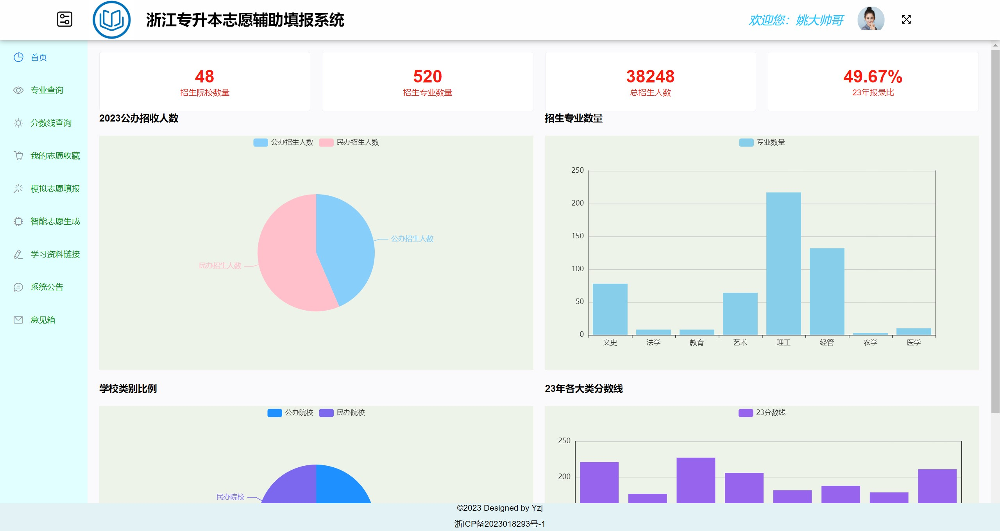
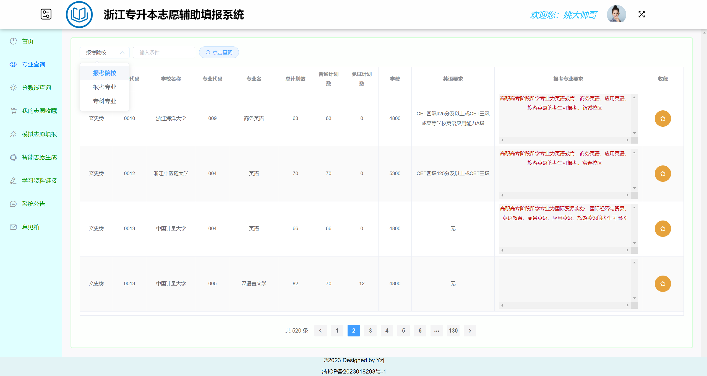
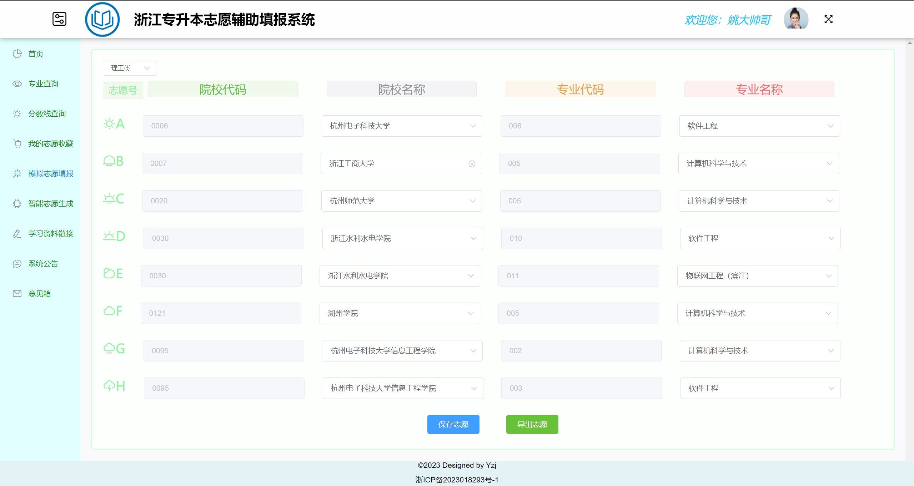

## 升本志愿辅助填报系统

#### 功能介绍：

1. 用户前端可视化信息界面，显示往年招生人数，报录比，饼状图，柱状图为主

2. 专业查询界面，用户可以根据自身想报考的专业，学校，专科所学专业信息进行查询

3. 分数查询界面近三年分数线查询，查询条件同上（专业查询界面）

4. 志愿收藏，导出，在专业查询界面，用户可收藏自己所中意的志愿，导出为excel文件
5. 模拟志愿填报，与浙江教育考试院最终所提供的报考系统相同，根据用户的专业和报考类型，模拟报考志愿，保存，并可导出作为最终报考时的参考
6. 智能志愿生成，根据提前训练好的神经网络人工智能模型，根据用户的基本信息，AI预测最终用户可能得到的分数，根据这个分数分成七个档次，分别对应能填报几个一本专业，二本专业，三本专业，填报专业以最容易考上的标准进行生成
7. 学习资料链接，可由机构老师提供些许学习资料，各类网盘的地址，提取码，主要为各类学习视频，考试试卷，资料为主
8. 系统公告，提前告知网站维护信息，重大更新信息
9. 意见箱，对于本系统尚且不足的地方，用户根据自身体验反馈给开发者或使用机构，由开发人员进行调整

#### 开发环境

###### 前端：Vue2.0+elementUI

###### 后端：SpringBoot+MybatisPlus+Redis+Maven

###### 运行环境：jdk11+mysql8.0

###### 神经网络：后端调用已经训练好的模型，该模型使用TensorFlow和Keras构建一个深度神经网络模型。该模型包括多个全连接层，并包括批量归一化层以加速训练和提高模型性能（详见主页项目）

在运行过程中请在application.yml文件中配置自己的mysql、redis地址

